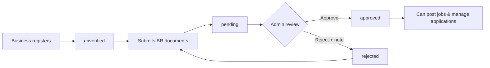

# FlexiGo

**Connect event businesses with reliable part-time workers**

FlexiGo is a modern Progressive Web Application (PWA) that bridges the gap between event businesses and skilled part-time workers. Built with Next.js 16, powered by Supabase for authentication, and using **Drizzle ORM** for type-safe, direct database access — FlexiGo provides a fast, reliable, and seamless platform for flexible workforce management.

[](https://nextjs.org/)
[](https://reactjs.org/)
[](https://www.typescriptlang.org/)
[](https://tailwindcss.com/)
[](https://supabase.com/)
[](https://orm.drizzle.team/)

---

## Table of Contents

- [Features](#-features)
- [Tech Stack](#-tech-stack)
- [Architecture Overview](#-architecture-overview)
- [Getting Started](#-getting-started)
- [Project Structure](#-project-structure)
- [Database Schema](#-database-schema)
- [Environment Setup](#-environment-setup)
- [Available Scripts](#-available-scripts)
- [API Routes](#-api-routes)
- [User Roles](#-user-roles)
- [PWA Features](#-pwa-features)
- [Contributing](#-contributing)
- [License](#-license)

---

## Features

### For Businesses
- **Business Verification** - Submit Business Registration (BR) documents for admin review before posting jobs
- **Verification Status Tracking** - View pending, approved, or rejected status with admin feedback on rejection
- **Create Job Postings** - Post flexible work opportunities (requires verified business status)
- **Manage Applications** - Review and manage worker applications efficiently, update acceptance/rejection status (verified only)
- **Business Profiles** - Create and manage comprehensive business profiles with logo, description, and social links
- **Find Talent** - Access a pool of skilled part-time workers with matching skill sets
- **Mobile-First** - Manage your workforce on the go

### For Admins
- **Admin Portal** - Dedicated dashboard at `/admin` with role-gated access (`role = "admin"`)
- **System Overview** - Platform statistics: pending verifications, verified businesses, total workers, and jobs posted
- **Verification Review Queue** - Review business submissions filtered by pending, approved, or rejected status
- **Approve / Reject Businesses** - Review BR certificates and supporting documents, approve verified businesses, or reject with a mandatory reason note
- **Responsive Admin UI** - Desktop sidebar navigation and mobile bottom nav for on-the-go moderation

### For Workers
- **Browse Jobs** - Discover relevant part-time opportunities filtered by location and skills
- **Recommended Jobs** - Get skill-based and location-aware job recommendations
- **Quick Apply** - Apply to jobs with your professional profile in one click
- **Withdraw Applications** - Withdraw submitted applications when needed
- **Worker Profiles** - Showcase your skills, availability, and geolocation
- **Track Applications** - Monitor all your job applications in one place
- **Work Schedule** - View accepted jobs in a personal work schedule

### Platform Features
- **Secure Authentication** - Email/password authentication with password recovery, powered by Supabase Auth
- **Inactivity Logout** - Automatic session expiry after 30 minutes of inactivity with a 5-minute warning
- **Modern UI/UX** - Clean, intuitive interface with Tailwind CSS and Framer Motion animations
- **Progressive Web App** - Installable on any device, works offline
- **Role-Based Access** - Separate workflows for businesses, workers, and administrators
- **Business Verification Gate** - My Jobs, Post Job, and Applications are locked until a business is admin-approved
- **Skill Taxonomy** - Curated skills catalogue for structured job matching
- **Geolocation Support** - Location-aware job and worker matching

---

## Tech Stack

### Frontend
- **Framework**: [Next.js 16](https://nextjs.org/) with App Router
- **Language**: [TypeScript 5](https://www.typescriptlang.org/) (strict mode)
- **UI Library**: [React 19](https://reactjs.org/)
- **Styling**: [Tailwind CSS 4](https://tailwindcss.com/)
- **Animations**: [Framer Motion 12](https://www.framer.com/motion/)
- **Validation**: [Zod 4](https://zod.dev/)
- **PWA**: [next-pwa](https://github.com/shadowwalker/next-pwa)

### Backend & Database
- **Authentication**: [Supabase Auth](https://supabase.com/docs/guides/auth) — handles user registration, login, JWT sessions, and password recovery
- **ORM**: [Drizzle ORM 0.45](https://orm.drizzle.team/) — type-safe SQL query builder and schema management
- **Database Driver**: [postgres.js 3](https://github.com/porsager/postgres) — pure-JS PostgreSQL client (no native bindings, Turbopack-compatible)
- **Database**: PostgreSQL via Supabase (direct connection via `DATABASE_URL`)
- **API**: Next.js Route Handlers (App Router)

> **Architecture Note:** Supabase is used exclusively for authentication. All data reads/writes (profiles, jobs, applications) are handled via **Drizzle ORM** connecting directly to the underlying PostgreSQL database. This gives full type safety at the query level, leverages Drizzle's inferred TypeScript types from the schema, and avoids the overhead of the Supabase REST API for data operations.

### Development Tools
- **ORM Toolkit**: [drizzle-kit 0.31](https://orm.drizzle.team/kit-docs/overview) — schema migrations and introspection
- **Linting**: ESLint with Next.js config
- **Package Manager**: npm

---

## Architecture Overview

```
┌─────────────────────────────────────────────────┐
│                  Next.js App                    │
│  ┌─────────────────┐   ┌─────────────────────┐  │
│  │  Client Pages   │   │   API Route         │  │
│  │  (React / TSX)  │   │   Handlers          │  │
│  └────────┬────────┘   └──────────┬──────────┘  │
│           │                       │             │
│           │  fetch / API client   │             │
│           └──────────┬────────────┘             │
└──────────────────────┼──────────────────────────┘
                       │
          ┌────────────┴─────────────┐
          │                          │
   ┌──────▼──────┐          ┌────────▼────────┐
   │ Supabase    │          │  Drizzle ORM    │
   │ Auth Only   │          │  (lib/db.ts)    │
   └─────────────┘          └────────┬────────┘
                                     │  postgres.js
                            ┌────────▼────────┐
                            │  PostgreSQL DB  │
                            │  (Supabase)     │
                            └─────────────────┘
```

---

## Getting Started

### Prerequisites

- Node.js 20.x or higher
- npm
- Supabase project (for Auth + PostgreSQL hosting)

### Installation

1. **Clone the repository**
   ```bash
   git clone <repository-url>
   cd FlexiGo
   ```

2. **Install dependencies**
   ```bash
   npm install
   ```

3. **Set up environment variables**

   Create a `.env.local` file in the root directory (see [Environment Setup](#-environment-setup)):
   ```env
   NEXT_PUBLIC_SUPABASE_URL=https://your-project.supabase.co
   NEXT_PUBLIC_SUPABASE_ANON_KEY=your-anon-key
   SUPABASE_SERVICE_ROLE_KEY=your-service-role-key
   NEXT_PUBLIC_APP_URL=http://localhost:3000
   DATABASE_URL=postgresql://postgres:<password>@db.<project-ref>.supabase.co:5432/postgres
   ```

4. **Run the development server**
   ```bash
   npm run dev
   ```

5. **Open your browser**

   Navigate to [http://localhost:3000](http://localhost:3000)

The application is also accessible on your local network at `http://<your-ip>:3000` (dev server bound to `0.0.0.0`).

---

## Project Structure

```
FlexiGo/
├── app/                          # Next.js App Router
│   ├── api/                      # API Route Handlers
│   │   ├── auth/                 # Authentication endpoints
│   │   │   ├── register/
│   │   │   ├── login/
│   │   │   ├── logout/
│   │   │   ├── forgot-password/
│   │   │   └── reset-password/
│   │   ├── workers/              # Worker profile endpoints
│   │   │   └── profile/
│   │   ├── businesses/           # Business profile endpoints
│   │   │   └── profile/
│   │   ├── jobs/                 # Job posting endpoints
│   │   │   ├── list/
│   │   │   ├── create/
│   │   │   ├── business/
│   │   │   ├── recommended/
│   │   │   ├── update-status/
│   │   │   └── [jobId]/
│   │   │       ├── applicants/
│   │   │       └── acceptance-status/
│   │   ├── applications/         # Application endpoints
│   │   │   ├── apply/
│   │   │   ├── business/
│   │   │   ├── worker/
│   │   │   ├── update/
│   │   │   └── withdraw/
│   │   ├── schedule/             # Worker schedule endpoint
│   │   │   └── worker/
│   │   ├── skills/               # Skills catalogue endpoint
│   │   ├── verification/         # Business verification endpoints
│   │   │   ├── status/
│   │   │   └── submit/
│   │   ├── admin/                # Admin-only endpoints
│   │   │   ├── stats/
│   │   │   └── verifications/
│   │   │       └── review/
│   │   └── check/                # Auth check / health endpoint
│   ├── admin/                    # Admin portal pages
│   │   ├── dashboard/            # System overview & stats
│   │   ├── verifications/        # Business verification review queue
│   │   ├── layout.tsx            # Admin layout with role guard
│   │   └── page.tsx              # Redirects to /admin/dashboard
│   ├── verification/             # Business document submission page
│   ├── components/               # Reusable React components
│   │   ├── ui/                   # Base UI components (Button, Input, Toast)
│   │   ├── AuthForm.tsx
│   │   ├── AuthRolePicker.tsx
│   │   ├── BottomNav.tsx
│   │   ├── Header.tsx
│   │   └── ServiceWorkerRegistration.tsx
│   ├── applications/             # Applications management pages
│   ├── dashboard/                # Dashboard page
│   ├── install/                  # PWA install prompt page
│   ├── jobs/                     # Job-related pages
│   ├── profile/                  # Profile pages (business & worker)
│   ├── login/                    # Login page
│   ├── register/                 # Registration page
│   ├── forgot-password/          # Password recovery
│   ├── reset-password/           # Password reset
│   ├── globals.css               # Global styles
│   ├── layout.tsx                # Root layout
│   └── page.tsx                  # Home / landing page
├── db/                           # Drizzle ORM
│   └── schema.ts                 # Database schema (tables + inferred TS types)
├── lib/                          # Utility libraries
│   ├── db.ts                     # Drizzle client singleton (postgres.js driver)
│   ├── supabase.ts               # Supabase client (auth only)
│   ├── supabaseAdmin.ts          # Supabase admin client (service role)
│   ├── api-client.ts             # Frontend API helper
│   ├── adminGuard.ts             # Admin JWT + role verification helper
│   ├── businessNav.tsx           # Shared business bottom-nav items
│   ├── businessVerification.ts   # Server-side verification status lookup
│   ├── businessVerification.shared.ts # Client-safe verification helpers
│   ├── activity-tracker.ts       # Inactivity logout logic
│   ├── hooks/
│   │   └── useBusinessVerification.ts # Client hook for verification status
│   ├── utils.ts                  # General helper functions
│   ├── skills/                   # Skills data
│   └── validators/               # Zod validation schemas
│       ├── authSchemas.ts
│       ├── jobSchemas.ts
│       ├── verificationSchemas.ts
│       └── workerSchemas.ts
├── types/                        # TypeScript type definitions
│   ├── business.d.ts
│   ├── worker.d.ts
│   └── location.d.ts
├── public/                       # Static assets
│   ├── icons/                    # App icons (PWA)
│   ├── manifest.json             # PWA manifest
│   └── sw.js                     # Service worker
├── proxy.ts                      # Dev proxy configuration
├── next.config.ts                # Next.js configuration (with next-pwa)
├── postcss.config.mjs            # PostCSS / Tailwind configuration
├── tsconfig.json                 # TypeScript configuration
└── package.json
```

---

## Database Schema

The schema is defined in TypeScript using **Drizzle ORM** (`db/schema.ts`). TypeScript types are automatically inferred — no manual type duplication required.

### Tables

#### `user_roles`
Stores the role and onboarding state for each authenticated user.

| Column | Type | Description |
|---|---|---|
| `user_id` | UUID (PK) | References Supabase `auth.users` |
| `role` | text | `"worker"`, `"business"`, or `"admin"` |
| `first_login_complete` | boolean | Whether the user has completed onboarding |
| `verification_status` | text | Business only: `"unverified"` \| `"pending"` \| `"approved"` \| `"rejected"` (null for workers/admins) |

#### `business_verifications`
Each row is one verification submission by a business. Businesses can re-submit after rejection; the latest row (by `submitted_at`) is the active submission.

| Column | Type | Description |
|---|---|---|
| `id` | UUID (PK) | Auto-generated |
| `business_id` | UUID | Business user ID |
| `business_reg_type` | text | `"pvt_ltd"` \| `"sole_proprietorship"` |
| `br_number` | text | Business Registration Number |
| `registered_name` | text | Legal name on certificate |
| `registered_address` | text | Address on certificate (optional) |
| `owner_nic` | text | Owner NIC (optional) |
| `certificate_url` | text | BR certificate (PDF/image) in Supabase Storage |
| `additional_doc_url` | text | Supporting document URL (optional) |
| `status` | text | `"pending"` \| `"approved"` \| `"rejected"` |
| `admin_note` | text | Rejection reason shown to the business |
| `reviewed_by` | UUID | Admin user who reviewed |
| `reviewed_at` | timestamptz | When the review was completed |
| `submitted_at` | timestamptz | Auto-set on submission |

#### `worker_profiles`
Extended profile information for workers.

| Column | Type | Description |
|---|---|---|
| `user_id` | UUID (PK) | |
| `name` | text | |
| `phone` | text | |
| `skills` | text[] | Array of skill tags |
| `availability` | text | `"flexible"` \| `"weekdays"` \| `"weekends"` |
| `city` | text | |
| `district` | text | |
| `latitude` | real | GPS coordinate |
| `longitude` | real | GPS coordinate |
| `formatted_address` | text | Human-readable address |

#### `business_profiles`
Extended profile information for businesses.

| Column | Type | Description |
|---|---|---|
| `user_id` | UUID (PK) | |
| `company_name` | text | |
| `description` | text | |
| `logo_url` | text | |
| `business_type` | text | |
| `location` | text | |
| `phone` | text | |
| `website` | text | |
| `years_experience` | integer | |
| `social_links` | jsonb | Array of social link objects |

#### `jobs`
Job postings created by businesses.

| Column | Type | Description |
|---|---|---|
| `id` | UUID (PK) | Auto-generated |
| `business_id` | UUID | Owner business |
| `title` | text | Job title |
| `date` | text | `YYYY-MM-DD` format |
| `time` | text | Start time |
| `working_hours` | real | Expected hours |
| `venue` / `venue_address` | text | Venue details |
| `venue_city` / `venue_district` | text | |
| `venue_latitude` / `venue_longitude` | real | GPS coordinates |
| `pay_rate` | real | Hourly pay |
| `required_skills` | text[] | Skill tags required |
| `number_of_workers` | integer | Headcount needed |
| `status` | text | `"open"` \| `"closed"` \| `"cancelled"` \| `"filled"` |
| `created_at` | timestamptz | Auto-set |

#### `applications`
Job applications submitted by workers. Enforces a unique constraint on `(job_id, worker_id)` to prevent duplicate applications.

| Column | Type | Description |
|---|---|---|
| `id` | UUID (PK) | Auto-generated |
| `job_id` | UUID | |
| `worker_id` | UUID | |
| `status` | text | `"pending"` \| `"accepted"` \| `"rejected"` \| `"withdrawn"` |
| `applied_at` | timestamptz | Auto-set |

---

## Environment Setup

### Required Environment Variables

Create a `.env.local` file in the project root:

```env
# Supabase Auth (public — safe for client-side)
NEXT_PUBLIC_SUPABASE_URL=https://your-project.supabase.co
NEXT_PUBLIC_SUPABASE_ANON_KEY=your-anon-key

# Supabase Admin (server-side only — never expose to client)
SUPABASE_SERVICE_ROLE_KEY=your-service-role-key

# Application URL
NEXT_PUBLIC_APP_URL=http://localhost:3000

# Direct PostgreSQL connection for Drizzle ORM (server-side only)
DATABASE_URL=postgresql://postgres:<password>@db.<project-ref>.supabase.co:5432/postgres
```

> **Security Note:** `SUPABASE_SERVICE_ROLE_KEY` and `DATABASE_URL` are **server-only** variables. They must never be prefixed with `NEXT_PUBLIC_` and are only accessible inside API Route Handlers.

### Supabase Setup

1. Create a new project on [Supabase](https://supabase.com)
2. Enable **Email Auth** under Authentication → Providers
3. Create the database tables listed in the [Database Schema](#-database-schema) section (or run migrations using `drizzle-kit`)
4. Create a **Storage bucket** named `verification-documents` for business BR certificate uploads
5. Configure Row Level Security (RLS) policies as appropriate
6. Copy the **Project URL**, **Anon Key**, **Service Role Key**, and **Direct Connection URI** into `.env.local`

### Creating an Admin Account

Admin users are assigned via the `user_roles` table (`role = "admin"`). After registering a normal account in Supabase Auth, set the role manually in the database:

```sql
INSERT INTO user_roles (user_id, role, first_login_complete, verification_status)
VALUES ('<supabase-auth-user-uuid>', 'admin', true, null)
ON CONFLICT (user_id) DO UPDATE SET role = 'admin';
```

Admins are redirected to `/admin/dashboard` on login. Non-admin users attempting to access `/admin/*` are redirected to the standard dashboard.

---

## Available Scripts

```bash
# Development server (accessible on local network)
npm run dev

# Production build
npm run build

# Start production server
npm start

# Run ESLint
npm run lint
```

---

## API Routes

All API routes are Next.js Route Handlers under `app/api/`. Data operations use the Drizzle ORM client (`lib/db.ts`); authentication operations use the Supabase client (`lib/supabase.ts` or `lib/supabaseAdmin.ts`).

### Authentication
| Method | Route | Description |
|---|---|---|
| `POST` | `/api/auth/register` | Register a new user (Supabase Auth + role assignment) |
| `POST` | `/api/auth/login` | User login, returns JWT tokens |
| `POST` | `/api/auth/logout` | Invalidate session |
| `POST` | `/api/auth/forgot-password` | Send password reset email |
| `POST` | `/api/auth/reset-password` | Reset password with token |
| `GET` | `/api/check` | Validate current auth session / health check |

### Worker Profiles
| Method | Route | Description |
|---|---|---|
| `GET` | `/api/workers/profile` | Get authenticated worker's profile |
| `POST` | `/api/workers/profile` | Create or update worker profile |

### Business Profiles
| Method | Route | Description |
|---|---|---|
| `GET` | `/api/businesses/profile` | Get authenticated business's profile |
| `POST` | `/api/businesses/profile` | Create or update business profile |

### Jobs
| Method | Route | Description |
|---|---|---|
| `GET` | `/api/jobs/list` | List all open jobs |
| `GET` | `/api/jobs/business` | Get jobs posted by the authenticated business *(verified only)* |
| `POST` | `/api/jobs/create` | Create a new job posting *(verified only)* |
| `POST` | `/api/jobs/update-status` | Update a job's status |
| `GET` | `/api/jobs/recommended` | Get skill & location based recommended jobs for worker |
| `GET` | `/api/jobs/[jobId]/applicants` | Get all applicants for a specific job |
| `GET` | `/api/jobs/[jobId]/acceptance-status` | Check worker's acceptance status for a job |

### Applications
| Method | Route | Description |
|---|---|---|
| `POST` | `/api/applications/apply` | Apply to a job |
| `GET` | `/api/applications/worker` | Get all applications for the authenticated worker |
| `GET` | `/api/applications/business` | Get all applications for the authenticated business *(verified only)* |
| `POST` | `/api/applications/update` | Update application status (accept / reject) |
| `POST` | `/api/applications/withdraw` | Withdraw a submitted application |

### Schedule & Skills
| Method | Route | Description |
|---|---|---|
| `GET` | `/api/schedule/worker` | Get accepted jobs for the worker's schedule view |
| `GET` | `/api/skills` | Fetch the full skills catalogue |

### Business Verification
| Method | Route | Description |
|---|---|---|
| `GET` | `/api/verification/status` | Get current verification status and latest submission for the authenticated business |
| `POST` | `/api/verification/submit` | Submit BR documents (multipart form: text fields + certificate file) |

### Admin (requires `role = "admin"`)
| Method | Route | Description |
|---|---|---|
| `GET` | `/api/admin/stats` | Platform overview: pending verifications, verified businesses, workers, jobs |
| `GET` | `/api/admin/verifications?status=` | List verification submissions (`pending`, `approved`, or `rejected`) |
| `POST` | `/api/admin/verifications/review` | Approve or reject a submission; updates `user_roles.verification_status` |

> **Verification enforcement:** Job posting, My Jobs, Applications, and related business APIs return `403` unless `verification_status = "approved"`.

---

## User Roles

### Worker
- Register and set up a profile with skills, availability, and geolocation
- Browse all open job listings
- View personalized recommended jobs (based on skills & proximity)
- Apply to and withdraw from job postings
- Track application status (pending / accepted / rejected / withdrawn)
- View upcoming accepted jobs in a work schedule

### Business
- Register and set up a business profile (logo, description, type, social links)
- Submit business verification documents (BR certificate, registration details) for admin review
- Track verification status: unverified → pending → approved / rejected
- **After approval only:** post jobs, view My Jobs, and manage applications
- Post job opportunities with skill requirements and location details
- View all applicants per job posting
- Accept or reject applicants
- Manage and update job statuses (open / closed / filled / cancelled)

### Admin
- Access the admin portal at `/admin/dashboard` (role-gated)
- View platform statistics: pending verifications, verified businesses, total workers, jobs posted
- Review business verification submissions in a pending / approved / rejected queue
- Open submission details: registration info, certificate, and optional supporting documents
- **Approve** a business — sets `verification_status` to `"approved"` and unlocks job posting
- **Reject** a business — requires an admin note explaining why; business can re-submit from `/verification`

### Business Verification Flow



---

## PWA Features

FlexiGo is a Progressive Web Application with:

- **Installable** - Add to home screen on Android, iOS, and desktop
- **Offline Support** - Service worker caches key assets for offline access
- **App-like Experience** - Standalone display mode (no browser chrome)
- **Responsive** - Works seamlessly on desktop, tablet, and mobile
- **Fast Loading** - Optimized performance with Next.js static + server rendering

### Manifest Configuration

```json
{
  "name": "FlexiGo",
  "short_name": "FlexiGo",
  "theme_color": "#124E66",
  "background_color": "#F8F9FA",
  "display": "standalone"
}
```

---

## License

This project is part of an individual academic project for Level 3 (Semester 5).

---

## Acknowledgments

- Built with [Next.js](https://nextjs.org/)
- Authentication by [Supabase](https://supabase.com/)
- Database ORM by [Drizzle ORM](https://orm.drizzle.team/)
- Animations by [Framer Motion](https://www.framer.com/motion/)
- Styled with [Tailwind CSS](https://tailwindcss.com/)

---

**Made for flexible workforce solutions**
